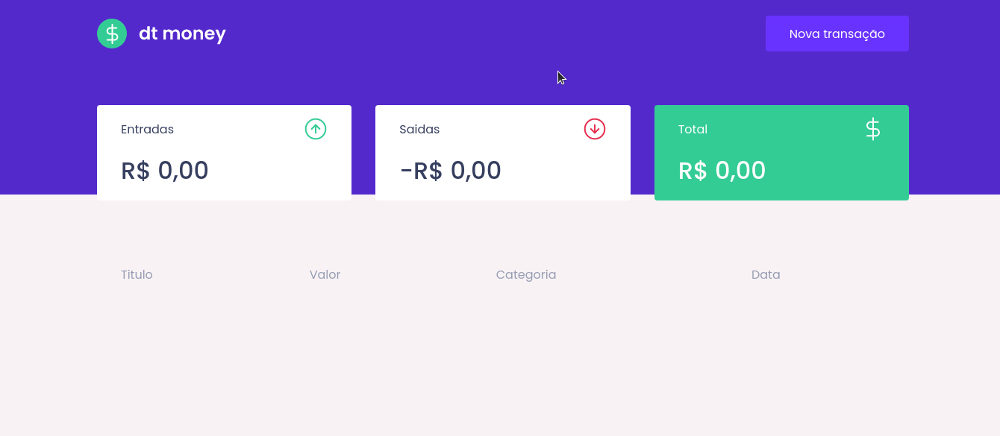

# DT Money

Organize suas finanças com **DT Money**.

<br><br>

## Demonstração



<br><br>

## Stack utilizada

**Front-end:** React, Styled-Components, Axios, Typescript, React-Modal

**Back-end - Node.js:** Express, Prisma, Typescript, Eslint/Prettier

**Back-end - Deno:** Opine, DenoDB, Typescript

**DevOps** Docker/Docker-compose

<br><br>

## Variáveis de Ambiente

Para rodar esse projeto, você vai precisar adicionar as seguintes variáveis de ambiente no seu .env

`SERVER_PORT`

`CLIENT_PORT`

`DATABASE_USER`

`DATABASE_DB_NAME`

`DATABASE_PASSWORD`

<br><br>

## Rodando localmente

Clone o projeto

```bash
  git clone https://github.com/mfortunat0/dtmoney
```

Entre no diretório do projeto

```bash
  cd dtmoney
```

Configure as variaveis de ambientes, suba os containers de acordo com servidor de preferencia, servido por Node ou Deno.

```bash
# Servido por Node
docker-compose up

# Servido po Deno
docker-compose -f docker-compose.deno.yml up
```

<br><br>

## Desenvolvimento

Para testar e fazer alterações, suba os containers de desenvolvimento de acordo com servidor de preferencia.

```bash
# Servido po Node
docker-compose -f docker-compose.dev.yml up

# Servido po Deno
docker-compose -f docker-compose.deno.dev.yml up
```
